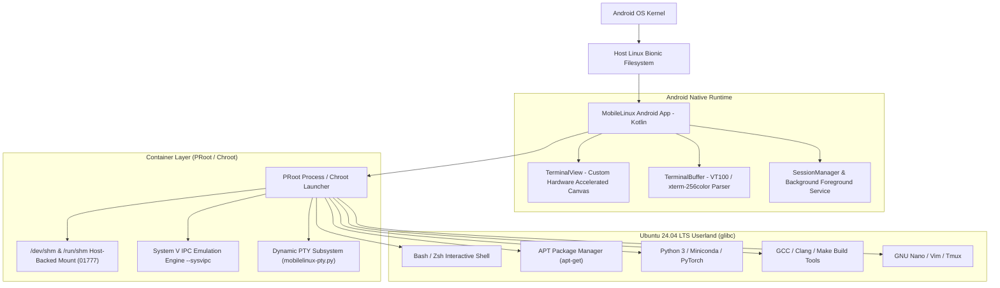

<div align="center">

  

  # MobileLinux
  
  **Authentic Ubuntu Linux 24.04 LTS & Modern Terminal Workstation for Android**

  [](LICENSE)
  [](https://github.com/udoymistry2024/MobileLinux/releases)
  [](https://ubuntu.com)
  [](#architecture)
  [](https://github.com/udoymistry2024/MobileLinux/releases)

  <p align="center">
    <a href="#key-features">Key Features</a> •
    <a href="#comparison">Comparison</a> •
    <a href="#quick-start">Quick Start</a> •
    <a href="#whats-new">What's New</a> •
    <a href="#architecture">Architecture</a> •
    <a href="#building-from-source">Build from Source</a> •
    <a href="#license">License</a>
  </p>

</div>

---

## 🚀 Overview

**MobileLinux** turns your Android smartphone or tablet into a full-fledged, authentic **Ubuntu Linux workstation**. Unlike lightweight Linux-like environments that rely on Android's Bionic libc, MobileLinux runs a **genuine GNU/Linux userland powered by glibc**, giving you 100% binary compatibility with standard Ubuntu Debian packages (`apt`), compilers, and machine-learning frameworks.

Whether you are compiling C/C++ projects with `gcc`, running a **Miniforge / Conda / PyTorch** deep learning pipeline, running **Node.js** web servers, or editing files in `nano` / `vim`, MobileLinux provides a seamless terminal experience directly on mobile.

---

## ✨ Key Features

- 🐧 **Authentic Ubuntu 24.04 LTS Userland:**
  Native `apt` package manager with access to tens of thousands of official Ubuntu packages.
- 📦 **Built-in Libraries & Packages Store (376+ Curated Packages):**
  Browse, search, install, and cleanly uninstall over 376 curated developer packages across 10 specialized categories (Python & Data Science, Compilers, Databases, Security/Pentesting, Web & APIs, DevOps, CLI Utilities, Audio/Media, Network Tools) with real-time stream output and progress tracking.
- 🐍 **Smart Python Data Science & CLI Ecosystem:**
  Direct CLI execution for Python modules like `numpy`, `pandas`, `scipy`, `sklearn`, `torch`, `matplotlib`, `seaborn`, `polars`, `sympy` via `/usr/local/bin` wrappers, dynamic `pkg-install-python` generator, and intelligent `command_not_found_handle` in bash.
- 📓 **Jupyter Notebook & Data Lab Ready:**
  Seamlessly launch Jupyter Notebook and JupyterLab with full POSIX `/dev/shm` shared memory support, multi-core multiprocessing, and zero kernel crashes.
- ⚡ **Zero Root Required (PRoot Technology):**
  Runs unprivileged in user-space via optimized PRoot virtualization with `--root-id` fake-root capabilities.
- 🔓 **Root Mode (Chroot) Support:**
  For rooted devices, execute with true kernel-level `chroot` for maximum raw I/O performance.
- 🛡️ **Intelligent Filesystem & Permission Engine:**
  Auto-heals read-only directory lockups and recursive permission problems with built-in `fix-permissions`, `force-rm`, and smart non-recursive `rm` wrapper.
- 🗑️ **Clean Uninstallation & Verification Engine:**
  Fast uninstallation with confirmation dialog, live progress feedback, automatic orphan dependency cleanup (`autoremove`), and robust verification.
- 🔄 **Preserved User Configuration:**
  User `.bashrc` profile modifications (Conda, Miniforge, NVM, Rust cargo, pyenv) are completely preserved across app restarts and session lifecycles.
- 🧠 **Full POSIX Shared Memory (`/dev/shm`) & System V IPC:**
  Full support for POSIX semaphores (`sem_open`), shared memory, and multi-process synchronization. Tools like **Miniforge, Anaconda, PyTorch DataLoader, and ProcessPoolExecutor** run without crashing!
- 🖥️ **Terminal Architecture:**
  - Full **xterm-256color** / VT100 emulation with sanitized `LS_COLORS`.
  - Complete **Scrolling Margins (`DECSTBM`)** & **Alternate Screen Buffer** support (GNU Nano, Vim, Less, Htop render cleanly).
  - True **Scrollback Buffer clearing (`E3` / `CSI 3 J`)** when typing `clear`.
  - In-band **Dynamic PTY Window Resizing** (`TIOCSWINSZ` / `SIGWINCH`) adapting automatically to keyboard popups and screen rotation.
- 📟 **tmux-Style Multi-Session Drawer:**
  Create unlimited parallel terminal sessions and seamlessly switch between them using the smooth navigation drawer.
- ⌨️ **Mobile-Optimized Keyboard Bar:**
  Dedicated touch bar with `ESC`, `Tab`, `Ctrl`, `Alt`, `Shift`, `Paste`, direction arrows (`↑ ↓ ← →`), and standard terminal modifiers.
- 🔋 **Background Persistence:**
  Android Foreground Service + WakeLock ensures your long-running scripts, downloads, and compilation tasks continue running when the screen is turned off or the app is minimized.

---

## 📊 Comparison

| Feature | **MobileLinux** | Termux | UserLAnd | AndroNix |
| :--- | :---: | :---: | :---: | :---: |
| **Linux C Library** | **glibc (True GNU/Linux)** | Bionic libc (Android) | glibc (PRoot) | glibc (PRoot) |
| **Ubuntu Rootfs** | **Ubuntu 24.04 LTS (Built-in)** | Termux custom repos | Various distros | Requires script |
| **1-Click Package Store (376+ pkgs)** | **✅ Built-in Store UI** | ❌ CLI only | ❌ CLI only | ⚠️ External scripts |
| **Python Data Science CLI (numpy/pandas)** | **✅ Instant CLI Wrappers** | ❌ python -c only | ❌ Manual | ❌ Manual |
| **POSIX Semaphores (`/dev/shm`)** | **✅ Built-in & Emulated** | ❌ Broken / Missing | ⚠️ Incomplete | ⚠️ Requires root/hacks |
| **Miniforge / Conda / PyTorch** | **✅ Out-of-the-box** | ❌ Requires patching | ⚠️ Prone to crashes | ⚠️ Prone to crashes |
| **Permission Auto-Healer (`fix-permissions`)** | **✅ Built-in** | ❌ None | ❌ None | ❌ None |
| **Full Terminal Editor Support (Nano)** | **✅ Alternate Buffer + DECSTBM** | ✅ Good | ⚠️ VNC dependent | ⚠️ VNC dependent |
| **Multiple Sessions Drawer** | **✅ Built-in (tmux-like)** | ⚠️ Basic drawer | ❌ External client | ❌ External client |
| **True `clear` Scrollback Wipe** | **✅ Full E3 Support** | ✅ Good | ❌ Basic | ❌ Basic |
| **Root + Non-Root Modes** | **✅ Both PRoot & Chroot** | ⚠️ Termux:Root add-on | ❌ PRoot only | ❌ PRoot only |

---

## 📲 Quick Start

### 1. Download & Install
Download the latest signed release APK from [**GitHub Releases**](https://github.com/udoymistry2024/MobileLinux/releases):
- **`MobileLinux-v1.6.1-beta.apk`** (or `MobileLinux-v1.6.1.apk`)

Install the APK on any device running **Android 8.0 (Oreo) or higher** (Targeting Android 15 / API 35).

### 2. First Launch
1. Open **MobileLinux**.
2. Grant notification and storage permissions (for accessing `/sdcard` and background service).
3. The initial setup will unpack the Ubuntu rootfs environment and configure the default user (`ubuntu`).
4. You will be greeted with the Ubuntu shell:
   ```bash
   ubuntu@mobilelinux:~$
   ```

### 3. Verify System Health
Run the following diagnostics to verify the environment:
```bash
# Check OS release
cat /etc/os-release

# Verify shared memory (/dev/shm)
ls -ld /dev/shm

# Test Python multiprocessing
python3 -c "import multiprocessing.synchronize; s = multiprocessing.Semaphore(1); print('Semaphore works perfectly')"
```

### 4. Install Node.js, npm, or Miniforge

#### Install Node.js & npm (Native APT):
```bash
sudo apt update
sudo apt install -y nodejs npm
node --version
npm --version
```

#### Install Miniforge (Conda & Mamba):
```bash
curl -L -O "https://github.com/conda-forge/miniforge/releases/latest/download/Miniforge3-Linux-aarch64.sh"
bash Miniforge3-Linux-aarch64.sh
```

---

<a name="whats-new"></a>
## 🆕 What's New

### v1.6.1 (Beta)
- 📦 **Desktop Applications in Built-in Libraries & Package Store:**
  - Added full graphical desktop applications directly to the built-in Package Store: **Visual Studio Code (GUI)**, **Firefox Browser**, **Chromium Browser**, **VLC Media Player**, **GIMP Image Editor**, **LibreOffice Suite**, **Geany IDE**, and **Inkscape Vector Graphics**.
  - One-click seamless installation and uninstallation with live percentage tracking.
  - Automatic desktop shortcuts in XFCE Application Menu, PRoot root bypass wrappers, and sandbox workarounds.
- 💻 **Microsoft Visual Studio Code (GUI) Integration:**
  - Full graphical VS Code desktop installation with official Microsoft APT repository and direct DEB fallback.
  - Auto-configured `--no-sandbox` wrapper (`/usr/local/bin/code`), hardware acceleration bypass, and XFCE desktop shortcut integration for seamless development in Desktop Mode.
- ⚡ **Desktop Startup & Performance Optimization:**
  - Resolved display server startup failure (`code 2`) by fixing script parsing and adding robust TigerVNC fallback.
  - Disabled software compositing and UI animations in XFCE for snappy 60fps mobile responsiveness.
- 🔋 **Global Screen Wake Lock & Persistent Background Installs:**
  - "Keep Screen On" toggle now functions globally across all screens (Terminal, Desktop, Libraries, Settings) in real-time.
  - Dedicated background package manager (`PackageInstallationManager`) with WakeLock and Android Foreground Service notifications keeps downloads and installations running uninterrupted when navigating away or minimizing the app.
- 🦊 **Native ARM64 & AMD64 Firefox Browser:**
  - Integrated official Launchpad Mozilla Team PPA repository and automatic portable bundle fallback for seamless Firefox installations.

### v1.6.0 (Desktop+ Edition)
- 🖥️ **Full Linux Desktop Mode (XFCE4 & TigerVNC):**
  - Pre-installed lightweight XFCE4 graphical desktop environment powered by native TigerVNC standalone server.
  - Fullscreen landscape mode with hardware-accelerated canvas, aspect-fill resolution, and floating HUD controls.
  - Laptop touchpad gesture controls: single tap left-click, two-finger right-click, two-finger vertical scrolling, and pinch zoom.
  - Physical OTG/Bluetooth mouse and keyboard support with native right-click pass-through.
  - Resilient PRoot background session management with active TCP readiness checks and clean exit.
- ⚡ **Zero-Delay Terminal Sessions:**
  - Asynchronous background process initialization completely eliminates the 2-3s UI freeze when opening new terminal sessions with the `+` button.
- 🐍 **Anaconda & Conda Lifecycle Overhaul:**
  - Resolved the 100% progress hang on package installations; UI now confirms installation immediately.
  - Eliminated circular recursion and false-positive binary detections.
- ⚙️ **Settings & Stability Improvements:**
  - Real-time font size scaling, audio terminal bell alerts, and screen awake persistence.
  - Crash/freeze recovery on app launch after force-stop or background kills.

### v1.5.5 (Stable - Browser Edition)
- 🌐 **Integrated Developer Browser & Jupyter Notebook Workstation:**
  - Built-in multi-tab developer browser with universal force dark mode for comfortable mobile development.
  - Full-featured mobile Jupyter Notebook & JupyterLab integration:
    - CodeMirror 6 virtual programmer keys (`()`, `[]`, `{}`, `""`, `:`, `;`, `$`, `_`, `=`, etc.) with auto-focus preservation.
    - Native clipboard Copy & Paste integration directly into active notebook cells.
    - Quick touch cell execution (top-right per-cell run buttons and floating dock).
    - Multi-tab lifecycle management: Close All Tabs action and clean startup without blank or duplicate tabs.
- 🖥️ **Terminal Screen Fitting & Contrast Polish:**
  - Auto screen fitting and high-contrast color palette for CLI tools (such as Antigravity, Htop, Tmux).
  - Improved readability and high-contrast styling across VT100/xterm emulator buffers.

### v1.5.1 (Beta)
- 🎨 **Setup Wizard Modernization & Visual Polish:** Redesigned initial setup, live progress, and completion screens with GitHub dark cards, system spec badges (`ARM64`, `Rootless PRoot`, `Noble 24.04`), and thumb-friendly bottom-anchored buttons.
- 🐧 **New Frameless Squircle App Logo:** Integrated a high-resolution, transparent RGBA squircle penguin logo with seamless edge blending and zero white rectangular borders.
- 📊 **4-Phase Live Installation Pipeline:** Interactive stage tracker displaying real-time extraction progress across PRoot 5.4 Engine, Ubuntu 24.04 ARM64 Rootfs, System Configuration, and Storage/APT integration.
- 📱 **Full-Screen Responsive Layout:** Eliminated top-clustering on tall modern devices, distributing content gracefully with dynamic vertical spacers.

### v1.5.0
- 📓 **Jupyter Notebook 7 `/tree` Touch Fix:** Patched Lumino touch events, Chrome popup blocker bypass, mobile quick actions floating bar, and template patchers for unhindered mobile file navigation and notebook creation.
- 🐍 **Miniconda3 / Conda Live Streaming & Auto-Activation:** Resolved 40% download stalls with live streaming progress, fast-path instant configuration, automatic `(base)` environment activation, and clean uninstallation syntax.

---

## 🏗️ Architecture



---

## 🛠️ Building from Source

### Prerequisites
- **JDK 17** or higher
- **Android SDK** (API 35, Build-Tools 35.0.0)
- **NDK** (Side-by-side)

### Build Commands
```bash
# Clone the repository
git clone https://github.com/udoymistry2024/MobileLinux.git
cd MobileLinux/MobileLinux

# Build release APK
./gradlew assembleRelease

# The signed release APK will be generated at:
# app/build/outputs/apk/release/app-release.apk
```

---

## 🤝 Contributing

Contributions, issues, and feature requests are welcome!
Feel free to check the [issues page](https://github.com/udoymistry2024/MobileLinux/issues) if you want to contribute.

1. Fork the Project
2. Create your Feature Branch (`git checkout -b feature/AmazingFeature`)
3. Commit your Changes (`git commit -m 'Add some AmazingFeature'`)
4. Push to the Branch (`git push origin feature/AmazingFeature`)
5. Open a Pull Request

---

## 📄 License

Distributed under the **MIT License**. See [`LICENSE`](LICENSE) for more information.

---

<div align="center">
  <sub>Developed with ❤️ by <a href="https://github.com/udoymistry2024">Udoy Mistry</a></sub>
</div>
